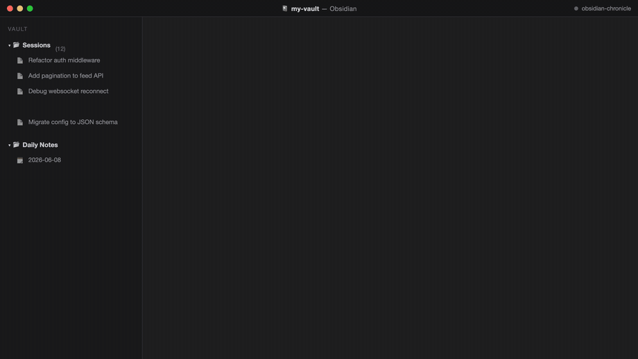
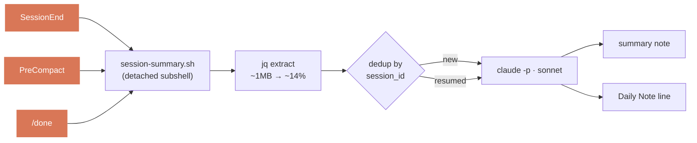

<div align="center">

# 📓 obsidian-chronicle

**Every Claude Code session, auto-written as a structured Obsidian note + a Daily Note line.**

📖 English · [日本語](docs/README.ja.md)


[](https://github.com/takashito/claude-obsidian-chronicle/actions/workflows/ci.yml)


<br>



</div>

---

End a session — `/clear`, `/new`, quit, auto-compact, or `/obsidian-chronicle:done` — and a few seconds later a summary note lands in your vault and today's Daily Note gets one more line. No clicks, no manual journaling.

A finished session becomes a structured note:

```markdown
─── <Vault>/Sessions/Restore session-summary.sh.md ───
---
title: Restore session-summary.sh
classification: task
session_id: 65a0ebe9-…
tags: [claude-session]
---
# Restore session-summary.sh
## 🎯 Goal … ## 💡 Key Decisions … ## 📝 Files Changed … > [!success] Result …
```

…and today's Daily Note gets one line linking back to it:

```markdown
─── <Vault>/Sessions/Daily Notes/2026-05-29.md (appended) ───
> [!success]+ ✅ Restore session-summary.sh
> [[Restore session-summary.sh]]
```

> [!NOTE]
> **Output language.** Notes are written in **English** by default. Set the `language` config key (e.g. `"language": "Japanese"`) — or pick it during `/obsidian-chronicle:setup` — to fully localize each note: the title (and filename), description, section headings, and callout text are all written in that language. The value is any language name, passed verbatim into the summarization prompt, so anything the model knows works (`"Français"`, `"한국어"`, …). File / function / tool names and code identifiers always stay in English; the note scaffolding is language-agnostic, so switching languages needs no code edits.

- 🎯 **Hook-triggered, not vibes** — fires on `SessionEnd`, `PreCompact`, and `/done`. Deterministic.
- 🔁 **Resume-aware** — resuming a session appends to the same note (matched by `session_id`), never a dup.
- 🗂️ **Two vault modes** — one machine-wide vault, or a per-project vault (e.g. a project wiki).
- 🛡️ **Hardened** — recursion guard, survives quit mid-write, skips rather than writing garbage.

## 🚀 Install

```
/plugin marketplace add takashito/claude-obsidian-chronicle
/plugin install obsidian-chronicle@obsidian-chronicle
/obsidian-chronicle:setup
```

`setup` auto-detects your vault (via the `obsidian` CLI if you have it), asks machine-wide vs per-project, and writes the config. That's it.

**Requirements:** Claude Code ≥ 2.1, `jq`, bash 3.2+, an Obsidian vault. **macOS / Linux are supported; Windows is experimental — see below.** The [`obsidian` CLI](https://github.com/yakitrak/obsidian-cli) is optional (vault auto-detect).

<details><summary>🪟 Windows (experimental, best-effort)</summary>

The hooks are bash scripts. Claude Code runs hook commands through **Git Bash** on Windows, so they *can* run there — but this is **not a fully tested platform**. To try it:

- **Install [Git for Windows](https://git-scm.com/download/win)** — it provides `bash` plus the `sed`/`awk`/`grep`/`find` coreutils the scripts need. If `bash.exe` isn't on `PATH`, point Claude Code at it: `setx CLAUDE_CODE_GIT_BASH_PATH "C:\Program Files\Git\bin\bash.exe"`. (Or use **WSL**, which behaves like Linux.)
- **Install `jq`** and make sure it's on `PATH` (Git Bash does not bundle it).
- **Line endings matter.** The repo ships a `.gitattributes` that forces `*.sh` to LF, so a normal checkout is fine. If you hand-edit a hook, keep it LF — a CRLF shebang becomes `bash\r` and the hook silently dies.

> [!WARNING]
> **Untested on Windows:** the summarizer runs in a detached background subshell (`( … ) & disown` + `trap '' HUP`) so it survives you quitting mid-session. That fork/signal behavior is verified on macOS/Linux only; under MSYS/Git Bash the background write may not survive the parent exiting. The hook will *fire*, but whether the note always lands is unverified. Reports/PRs welcome.

</details>

**Update:** `/plugin marketplace update obsidian-chronicle` then `/plugin update obsidian-chronicle@obsidian-chronicle`.

<details><summary>Local / dev install</summary>

```bash
git clone https://github.com/takashito/claude-obsidian-chronicle ~/dev/claude-obsidian-chronicle
```
```jsonc
// ~/.claude/settings.json — merge with what you have
{
  "extraKnownMarketplaces": {
    "obsidian-chronicle": { "source": { "source": "directory", "path": "/Users/YOU/dev/claude-obsidian-chronicle" } }
  },
  "enabledPlugins": { "obsidian-chronicle@obsidian-chronicle": true }
}
```
</details>

## 🪝 Triggers

| Trigger | When |
|---|---|
| `/clear`, `/new`, quit | you end or restart a session |
| auto-compact | context fills up |
| `/obsidian-chronicle:done` | manual mid-session checkpoint (queues in background, one-line ack) |

> [!WARNING]
> Won't fire on `kill -9`, on closing the VS Code panel without `/clear` (use `/done`), or on idle disconnect.

> [!NOTE]
> GUI front-ends (Claudian, etc.) work fine — transcripts still land in `~/.claude/projects/…` and `SessionEnd` gets the exact path. For `/done`, `done-runner.sh` finds the session via `CLAUDE_SESSION_ID` → Claudian metadata → newest transcript.

## ⚙️ How it works



`session-summary.sh` runs the whole thing in a detached background subshell, so your CLI returns instantly:

1. **Resolve config** (`resolve-config.sh`) — vault path, model, dirs.
2. **Extract** — `jq` strips the JSONL to user/assistant prose; tool I/O collapses to `[tool_use: Bash]` markers (~1 MB → ~14%), so it never blows Haiku's context.
3. **Dedup** by `session_id` — fresh note, or an addendum if the session was resumed.
4. **Summarize** with `claude -p`, write the note, append the Daily Note.

## 🔧 Configuration

One JSON file — machine-wide or per-project.

| Scope | Path |
|---|---|
| machine-wide | `${XDG_STATE_HOME:-~/.local/state}/obsidian-chronicle/obsidian-chronicle.json` |
| per-project | `<repo>/.claude/obsidian-chronicle.json` (searched upward from cwd) |

Merged low→high: **defaults → user → project**. `vaultPath` resolves **project → user → `obsidian vault` CLI → skip** — no silent `~/obsidian` guess.

| Key | Default | Notes |
|---|---|---|
| `vaultPath` | _(detected)_ | vault root; absolute or `~` |
| `sessionsDir` | `Sessions` | relative → under the vault |
| `dailyDir` | `<sessionsDir>/Daily Notes` | |
| `model` | `sonnet` | `haiku` · `sonnet` · `opus` |
| `language` | `English` | output language for summary / title / headings; any language name, passed verbatim to the prompt |
| `log` | `~/.local/state/obsidian-chronicle/process.log` | activity log |
| `minBytes` / `maxBytes` | `200` / `1000000` | skip if the extracted convo is smaller / larger |

See what resolves: `hooks/resolve-config.sh "$PWD"`. Config is re-read on every fire — no restart needed.

## 🩺 Troubleshooting

```bash
tail -f ~/.local/state/obsidian-chronicle/process.log
```

Every fire logs a `start:` line and a result:

| Line | What it means |
|---|---|
| `start: session=… reason=… source=…` | a fire began |
| `wrote <path> [class=task, new]` | ✓ note written |
| `appended <path> [… resumed]` | ✓ addendum added to an existing note |
| `skip: no vault configured` | run `/obsidian-chronicle:setup`, or set `vaultPath` |
| `skip: empty/trivial conversation` | nothing to summarize (expected) |
| `skip: in-progress lock held` | another fire for this session is already running |
| `fail: claude -p exit=N` | check `claude` in PATH / the `model` value / network |
| `fail: … Prompt is too long` | set `model` to `opus` (1M context), or lower `maxBytes` to skip oversized conversations |

## 🛡️ Reliability

Built to run for months without writing junk:

- **Recursion guard** — `claude -p` spawns its own session; a flag stops the inner `SessionEnd` from recursing.
- **Survives quit** — `trap '' HUP` lets the summary finish even if you exit mid-write.
- **Per-session lock** — `PreCompact` + `/done` + `SessionEnd` can't double-write the same session.
- **Skips, never guesses** — empty/oversized convo, `claude -p` errors, or no vault → log + exit, no garbage note.
- **No `eval`** — config is read with `jq -r`; values never execute.

## 📊 Comparison

How it compares to other Claude Code journaling tools → **[COMPARISON.md](docs/COMPARISON.md)**. Short version: a few tools write AI summaries into Obsidian too, but chronicle is the hands-off one — a marketplace plugin that's *hook-triggered (nothing to run) and resume-aware*.

## ❓ FAQ

### How do I automatically save Claude Code sessions to Obsidian?
Install obsidian-chronicle and run `/obsidian-chronicle:setup`. From then on, ending a session (`/clear`, quit, auto-compact, or `/done`) writes a structured note to your vault and a linked line to today's Daily Note — no manual step.

### Does it create a new note every time I resume a session?
No. Resumed sessions are matched by `session_id` and **appended to the same note**, so one task stays one note (no duplicates).

### Is this an Obsidian plugin?
No — it's a *Claude Code* plugin that writes Markdown into your Obsidian vault. You install it via Claude Code's `/plugin`, not Obsidian's community-plugin browser.

### Can it write notes in a language other than English?
Yes. Set the `language` config key (e.g. `"language": "Japanese"`) and the whole note — title, headings, callouts — is written in that language. File/function names stay in English.

### Does it need a daemon, Python, or a build step?
No. Pure bash + jq. macOS/Linux are supported; Windows is experimental.

## 🗑️ Uninstall

```
/plugin uninstall obsidian-chronicle@obsidian-chronicle
/plugin marketplace remove obsidian-chronicle
rm -rf ~/.local/state/obsidian-chronicle   # optional: logs + config
```

Your notes stay where they are.

## 🧪 Development

```
.claude-plugin/{plugin,marketplace}.json   manifests
commands/{setup,done}.md                    slash commands
hooks/session-summary.sh                    the writer
hooks/resolve-config.sh                     config resolver
hooks/done-runner.sh                        backs /done
tests/test-resolve-config.sh                unit tests
```

```bash
# fire a hook with a synthetic payload
echo '{"session_id":"test","transcript_path":"/path/real.jsonl","cwd":"/tmp","reason":"clear"}' \
  | hooks/session-summary.sh

bash tests/test-resolve-config.sh   # run the tests
hooks/done-runner.sh                # simulate /done
```

Bash 3.2 (macOS default) — no associative arrays. Summary prompts are inline in `session-summary.sh` (search `You are summarizing` / `You are extending`). No build step.

## 📜 License

MIT — see [LICENSE](LICENSE).
