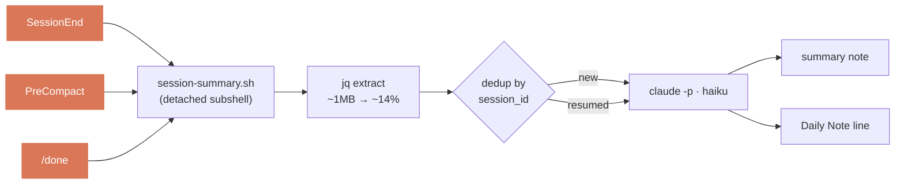

<div align="center">

# 📓 obsidian-chronicle

**Every Claude Code session, auto-written as a structured Obsidian note + a Daily Note line.**


[](https://github.com/takashito/claude-obsidian-chronicle/actions/workflows/ci.yml)


</div>

---

End a session — `/clear`, `/new`, quit, auto-compact, or `/obsidian-chronicle:done` — and a few seconds later a summary note lands in your vault and today's Daily Note gets one more line. No clicks, no manual journaling.

A finished session becomes a structured note:

```markdown
─── <Vault>/Sessions/Restore session-summary.sh.md ───
---
title: Restore session-summary.sh
classification: task
session_id: 65a0ebe9-…
tags: [claude-session]
---
# Restore session-summary.sh
## 🎯 Goal … ## 💡 Key Decisions … ## 📝 Files Changed … > [!success] Result …
```

…and today's Daily Note gets one line linking back to it:

```markdown
─── <Vault>/Sessions/Daily Notes/2026-05-29.md (appended) ───
> [!success]+ ✅ Restore session-summary.sh
> [[Restore session-summary.sh]]
```

> [!NOTE]
> Summary language is set by the prompt in `hooks/session-summary.sh` — edit it to write notes in whatever language you want.

- 🎯 **Hook-triggered, not vibes** — fires on `SessionEnd`, `PreCompact`, and `/done`. Deterministic.
- 🔁 **Resume-aware** — resuming a session appends to the same note (matched by `session_id`), never a dup.
- 🗂️ **Two vault modes** — one machine-wide vault, or a per-project vault (e.g. a project wiki).
- 🛡️ **Hardened** — recursion guard, survives quit mid-write, skips rather than writing garbage.

## 🚀 Install

```
/plugin marketplace add takashito/claude-obsidian-chronicle
/plugin install obsidian-chronicle@obsidian-chronicle
/obsidian-chronicle:setup
```

`setup` auto-detects your vault (via the `obsidian` CLI if you have it), asks machine-wide vs per-project, and writes the config. That's it.

**Requirements:** Claude Code ≥ 2.1, `jq`, bash 3.2+, an Obsidian vault. macOS/Linux. The [`obsidian` CLI](https://github.com/yakitrak/obsidian-cli) is optional (vault auto-detect).

**Update:** `/plugin marketplace update obsidian-chronicle` then `/plugin update obsidian-chronicle@obsidian-chronicle`.

<details><summary>Local / dev install</summary>

```bash
git clone https://github.com/takashito/claude-obsidian-chronicle ~/dev/claude-obsidian-chronicle
```
```jsonc
// ~/.claude/settings.json — merge with what you have
{
  "extraKnownMarketplaces": {
    "obsidian-chronicle": { "source": { "source": "directory", "path": "/Users/YOU/dev/claude-obsidian-chronicle" } }
  },
  "enabledPlugins": { "obsidian-chronicle@obsidian-chronicle": true }
}
```
</details>

## 🪝 Triggers

| Trigger | When |
|---|---|
| `/clear`, `/new`, quit | you end or restart a session |
| auto-compact | context fills up |
| `/obsidian-chronicle:done` | manual mid-session checkpoint (queues in background, one-line ack) |

> [!WARNING]
> Won't fire on `kill -9`, on closing the VS Code panel without `/clear` (use `/done`), or on idle disconnect.

> [!NOTE]
> GUI front-ends (Claudian, etc.) work fine — transcripts still land in `~/.claude/projects/…` and `SessionEnd` gets the exact path. For `/done`, `done-runner.sh` finds the session via `CLAUDE_SESSION_ID` → Claudian metadata → newest transcript.

## ⚙️ How it works



`session-summary.sh` runs the whole thing in a detached background subshell, so your CLI returns instantly:

1. **Resolve config** (`resolve-config.sh`) — vault path, model, dirs.
2. **Extract** — `jq` strips the JSONL to user/assistant prose; tool I/O collapses to `[tool_use: Bash]` markers (~1 MB → ~14%), so it never blows Haiku's context.
3. **Dedup** by `session_id` — fresh note, or an addendum if the session was resumed.
4. **Summarize** with `claude -p`, write the note, append the Daily Note.

## 🔧 Configuration

One JSON file — machine-wide or per-project.

| Scope | Path |
|---|---|
| machine-wide | `${XDG_STATE_HOME:-~/.local/state}/obsidian-chronicle/obsidian-chronicle.json` |
| per-project | `<repo>/.claude/obsidian-chronicle.json` (searched upward from cwd) |

Merged low→high: **defaults → user → project**. `vaultPath` resolves **project → user → `obsidian vault` CLI → skip** — no silent `~/obsidian` guess.

| Key | Default | Notes |
|---|---|---|
| `vaultPath` | _(detected)_ | vault root; absolute or `~` |
| `sessionsDir` | `Sessions` | relative → under the vault |
| `dailyDir` | `<sessionsDir>/Daily Notes` | |
| `model` | `haiku` | `haiku` · `sonnet` · `opus` |
| `log` | `~/.local/state/obsidian-chronicle/process.log` | activity log |
| `minBytes` / `maxBytes` | `200` / `1000000` | skip if the extracted convo is smaller / larger |

See what resolves: `hooks/resolve-config.sh "$PWD"`. Config is re-read on every fire — no restart needed.

## 🩺 Troubleshooting

```bash
tail -f ~/.local/state/obsidian-chronicle/process.log
```

Every fire logs a `start:` line and a result:

| Line | What it means |
|---|---|
| `start: session=… reason=… source=…` | a fire began |
| `wrote <path> [class=task, new]` | ✓ note written |
| `appended <path> [… resumed]` | ✓ addendum added to an existing note |
| `skip: no vault configured` | run `/obsidian-chronicle:setup`, or set `vaultPath` |
| `skip: empty/trivial conversation` | nothing to summarize (expected) |
| `skip: in-progress lock held` | another fire for this session is already running |
| `fail: claude -p exit=N` | check `claude` in PATH / the `model` value / network |
| `fail: … Prompt is too long` | raise `maxBytes`, or set `model` to `sonnet` |

## 🛡️ Reliability

Built to run for months without writing junk:

- **Recursion guard** — `claude -p` spawns its own session; a flag stops the inner `SessionEnd` from recursing.
- **Survives quit** — `trap '' HUP` lets the summary finish even if you exit mid-write.
- **Per-session lock** — `PreCompact` + `/done` + `SessionEnd` can't double-write the same session.
- **Skips, never guesses** — empty/oversized convo, `claude -p` errors, or no vault → log + exit, no garbage note.
- **No `eval`** — config is read with `jq -r`; values never execute.

## 📊 Comparison

How it stacks up against other session-logging / Obsidian plugins → **[COMPARISON.md](COMPARISON.md)**. Short version: it's the only one doing *automatic AI summaries → Obsidian Daily Notes, resume-aware*.

## 🗑️ Uninstall

```
/plugin uninstall obsidian-chronicle@obsidian-chronicle
/plugin marketplace remove obsidian-chronicle
rm -rf ~/.local/state/obsidian-chronicle   # optional: logs + config
```

Your notes stay where they are.

## 🧪 Development

```
.claude-plugin/{plugin,marketplace}.json   manifests
commands/{setup,done}.md                    slash commands
hooks/session-summary.sh                    the writer
hooks/resolve-config.sh                     config resolver
hooks/done-runner.sh                        backs /done
tests/test-resolve-config.sh                unit tests
```

```bash
# fire a hook with a synthetic payload
echo '{"session_id":"test","transcript_path":"/path/real.jsonl","cwd":"/tmp","reason":"clear"}' \
  | hooks/session-summary.sh

bash tests/test-resolve-config.sh   # run the tests
hooks/done-runner.sh                # simulate /done
```

Bash 3.2 (macOS default) — no associative arrays. Summary prompts are inline in `session-summary.sh` (search `You are summarizing` / `You are extending`). No build step.

## 📜 License

MIT — see [LICENSE](LICENSE).
