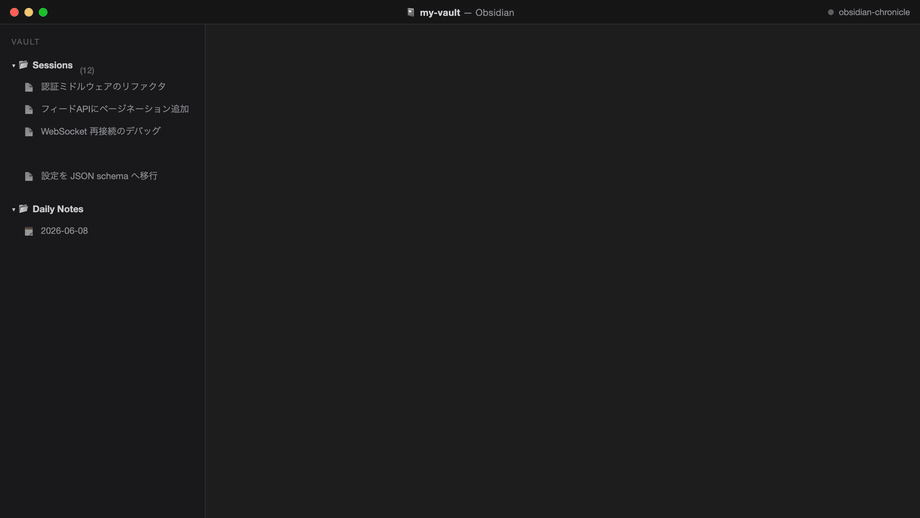
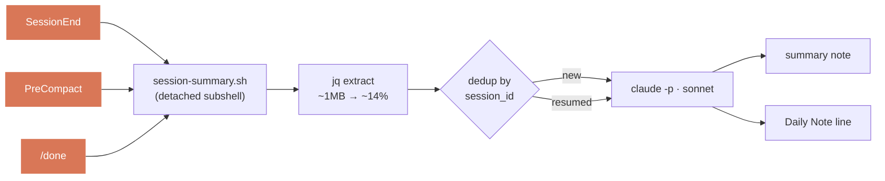

<div align="center">

# 📓 obsidian-chronicle

**Claude Code の全セッションを、構造化された Obsidian ノート + Daily Note の1行として自動で書き残す。**

📖 [English](../README.md) · 日本語


[](https://github.com/takashito/claude-obsidian-chronicle/actions/workflows/ci.yml)


<br>



</div>

---

セッションを終了する（`/clear`・`/new`・終了・auto-compact・`/obsidian-chronicle:done`）と、数秒後には要約ノートが Vault に届き、今日の Daily Note に1行追加されます。クリックも手動のジャーナリングも不要です。

終わったセッションは、構造化ノートになります:

```markdown
─── <Vault>/Sessions/Restore session-summary.sh.md ───
---
title: Restore session-summary.sh
classification: task
session_id: 65a0ebe9-…
tags: [claude-session]
---
# Restore session-summary.sh
## 🎯 Goal … ## 💡 Key Decisions … ## 📝 Files Changed … > [!success] Result …
```

…そして今日の Daily Note には、そこへリンクする1行が追加されます:

```markdown
─── <Vault>/Sessions/Daily Notes/2026-05-29.md (appended) ───
> [!success]+ ✅ Restore session-summary.sh
> [[Restore session-summary.sh]]
```

> [!NOTE]
> **出力言語。** ノートはデフォルトで **英語** で書かれます。`language` 設定キー（例: `"language": "Japanese"`）を指定する — または `/obsidian-chronicle:setup` で選ぶ — と、各ノートが完全にローカライズされます。タイトル（およびファイル名）、説明、セクション見出し、コールアウトのテキストがすべてその言語で書かれます。値は任意の言語名で、要約プロンプトにそのまま渡されるため、モデルが知っている言語なら何でも動きます（`"Français"`、`"한국어"` …）。ファイル名 / 関数名 / ツール名・コード識別子は常に英語のままです。ノートの骨組みは言語非依存なので、言語の切り替えにコード変更は要りません。

- 🎯 **フック起動・気分まかせではない** — `SessionEnd` / `PreCompact` / `/done` で発火。決定論的。
- 🔁 **再開対応** — セッションを再開すると同じノートに追記（`session_id` で照合）、重複を作らない。
- 🗂️ **2つの Vault モード** — マシン共通の Vault、またはプロジェクトごとの Vault（例: プロジェクト Wiki）。
- 🛡️ **堅牢** — 再帰ガード、書き込み途中の終了に耐える、ゴミを書くくらいならスキップ。

## 🚀 インストール

```
/plugin marketplace add takashito/claude-obsidian-chronicle
/plugin install obsidian-chronicle@obsidian-chronicle
/obsidian-chronicle:setup
```

`setup` が Vault を自動検出し（`obsidian` CLI があればそれ経由）、マシン共通かプロジェクト単位かを尋ね、設定を書き出します。これだけです。

**必要要件:** Claude Code ≥ 2.1、`jq`、bash 3.2+、Obsidian Vault。**macOS / Linux 対応。Windows は実験的 — 下記参照。** [`obsidian` CLI](https://github.com/yakitrak/obsidian-cli) は任意（Vault 自動検出用）。

<details><summary>🪟 Windows（実験的・ベストエフォート）</summary>

フックは bash スクリプトです。Claude Code は Windows ではフックコマンドを **Git Bash** 経由で実行するため、動作は *します* — ただし **十分にテストされたプラットフォームではありません**。試す場合:

- **[Git for Windows](https://git-scm.com/download/win) をインストール** — `bash` とスクリプトが必要とする `sed`/`awk`/`grep`/`find` の coreutils が入ります。`bash.exe` が `PATH` にない場合は Claude Code に場所を教えます: `setx CLAUDE_CODE_GIT_BASH_PATH "C:\Program Files\Git\bin\bash.exe"`。（または Linux と同様に動く **WSL** を使用。）
- **`jq` をインストール**し `PATH` に通します（Git Bash には同梱されていません）。
- **改行コードに注意。** リポジトリには `*.sh` を LF に固定する `.gitattributes` が含まれるため、通常のチェックアウトは問題ありません。フックを手で編集する場合は LF を維持してください — CRLF の shebang は `bash\r` になり、フックが無言で死にます。

> [!WARNING]
> **Windows では未検証:** 要約処理はデタッチされたバックグラウンドサブシェル（`( … ) & disown` + `trap '' HUP`）で動き、セッション途中で終了しても生き残ります。この fork/シグナル挙動は macOS/Linux でのみ検証済みで、MSYS/Git Bash では親プロセス終了後にバックグラウンド書き込みが生き残らない可能性があります。フックは*発火*しますが、ノートが必ず届くかは未検証です。報告・PR 歓迎。

</details>

**アップデート:** `/plugin marketplace update obsidian-chronicle` のあと `/plugin update obsidian-chronicle@obsidian-chronicle`。

<details><summary>ローカル / 開発インストール</summary>

```bash
git clone https://github.com/takashito/claude-obsidian-chronicle ~/dev/claude-obsidian-chronicle
```
```jsonc
// ~/.claude/settings.json — 既存の内容にマージ
{
  "extraKnownMarketplaces": {
    "obsidian-chronicle": { "source": { "source": "directory", "path": "/Users/YOU/dev/claude-obsidian-chronicle" } }
  },
  "enabledPlugins": { "obsidian-chronicle@obsidian-chronicle": true }
}
```
</details>

## 🪝 トリガー

| トリガー | タイミング |
|---|---|
| `/clear`・`/new`・終了 | セッションを終了 / 再起動したとき |
| auto-compact | コンテキストが一杯になったとき |
| `/obsidian-chronicle:done` | セッション途中の手動チェックポイント（バックグラウンドにキュー、1行で確認応答） |

> [!WARNING]
> 次の場合は発火しません: `kill -9`、`/clear` せずに VS Code パネルを閉じる（`/done` を使ってください）、アイドル切断。

> [!NOTE]
> GUI フロントエンド（Claudian など）でも問題なく動きます — transcript は `~/.claude/projects/…` に残り、`SessionEnd` が正確なパスを受け取ります。`/done` では `done-runner.sh` が `CLAUDE_SESSION_ID` → Claudian メタデータ → 最新 transcript の順でセッションを特定します。

## ⚙️ しくみ



`session-summary.sh` は全処理をデタッチされたバックグラウンドサブシェルで実行するため、CLI は即座に返ります:

1. **設定を解決**（`resolve-config.sh`）— Vault パス、モデル、ディレクトリ。
2. **抽出** — `jq` が JSONL を user/assistant の発話だけに削ぎ落とし、ツール I/O は `[tool_use: Bash]` マーカーに圧縮（~1 MB → ~14%）。Haiku のコンテキストを溢れさせません。
3. **重複排除** — `session_id` で照合し、新規ノートか、再開なら追記（addendum）。
4. **要約** — `claude -p` で要約し、ノートを書き、Daily Note に追記。

## 🔧 設定

JSON ファイル1つ — マシン共通またはプロジェクト単位。

| スコープ | パス |
|---|---|
| マシン共通 | `${XDG_STATE_HOME:-~/.local/state}/obsidian-chronicle/obsidian-chronicle.json` |
| プロジェクト単位 | `<repo>/.claude/obsidian-chronicle.json`（cwd から上方向に探索） |

低→高でマージ: **デフォルト → user → project**。`vaultPath` は **project → user → `obsidian vault` CLI → スキップ** の順で解決 — `~/obsidian` を黙って推測することはありません。

| キー | デフォルト | 補足 |
|---|---|---|
| `vaultPath` | _(検出)_ | Vault ルート。絶対パスまたは `~` |
| `sessionsDir` | `Sessions` | 相対指定 → Vault 配下 |
| `dailyDir` | `<sessionsDir>/Daily Notes` | |
| `model` | `sonnet` | `haiku` · `sonnet` · `opus` |
| `language` | `English` | 要約 / タイトル / 見出しの出力言語。任意の言語名をプロンプトにそのまま渡す |
| `log` | `~/.local/state/obsidian-chronicle/process.log` | 動作ログ |
| `minBytes` / `maxBytes` | `200` / `1000000` | 抽出後の会話がこれより小さい / 大きい場合はスキップ |

解決結果の確認: `hooks/resolve-config.sh "$PWD"`。設定は毎回の発火時に読み直されます — 再起動不要。

## 🩺 トラブルシューティング

```bash
tail -f ~/.local/state/obsidian-chronicle/process.log
```

発火ごとに `start:` 行と結果が記録されます:

| ログ行 | 意味 |
|---|---|
| `start: session=… reason=… source=…` | 発火開始 |
| `wrote <path> [class=task, new]` | ✓ ノートを書き込み |
| `appended <path> [… resumed]` | ✓ 既存ノートに追記 |
| `skip: no vault configured` | `/obsidian-chronicle:setup` を実行、または `vaultPath` を設定 |
| `skip: empty/trivial conversation` | 要約するものがない（想定どおり） |
| `skip: in-progress lock held` | このセッションの別の発火が実行中 |
| `fail: claude -p exit=N` | `claude` が PATH にあるか / `model` の値 / ネットワークを確認 |
| `fail: … Prompt is too long` | `model` を `opus`（1M コンテキスト）に、または `maxBytes` を下げて巨大な会話をスキップ |

## 🛡️ 信頼性

何ヶ月もゴミを書かずに動き続けるよう設計:

- **再帰ガード** — `claude -p` は自分のセッションを生成する。フラグで内側の `SessionEnd` の再帰を止める。
- **終了に耐える** — `trap '' HUP` により、書き込み途中で終了しても要約を完了できる。
- **セッション単位ロック** — `PreCompact` + `/done` + `SessionEnd` が同じセッションを二重書き込みしない。
- **推測せずスキップ** — 空/巨大な会話、`claude -p` エラー、Vault 未設定 → ログ出力して終了。ゴミノートを書かない。
- **`eval` 不使用** — 設定は `jq -r` で読む。値が実行されることはない。

## 📊 比較

他の Claude Code ジャーナリングツールとの比較 → **[COMPARISON.md](COMPARISON.md)**。要約すると: AI 要約を Obsidian に書くツールは他にもありますが、chronicle は完全にハンズオフ — *フック起動（何も実行しない）かつ再開対応* のマーケットプレイスプラグインです。

## ❓ よくある質問

### Claude Code のセッションを自動で Obsidian に保存するには？
obsidian-chronicle をインストールして `/obsidian-chronicle:setup` を実行します。以降、セッションを終了する（`/clear`・終了・auto-compact・`/done`）たびに、構造化ノートが Vault に、リンク行が今日の Daily Note に書き込まれます — 手動操作は不要です。

### セッションを再開するたびに新しいノートが作られますか？
いいえ。再開したセッションは `session_id` で照合され、**同じノートに追記**されます。1タスク = 1ノートのまま（重複なし）です。

### これは Obsidian プラグインですか？
いいえ — *Claude Code* のプラグインで、Obsidian Vault に Markdown を書き込みます。Obsidian のコミュニティプラグインブラウザではなく、Claude Code の `/plugin` でインストールします。

### 英語以外の言語でノートを書けますか？
はい。`language` 設定キー（例: `"language": "Japanese"`）を指定すると、ノート全体 — タイトル・見出し・コールアウト — がその言語で書かれます。ファイル名・関数名は英語のままです。

### デーモンや Python、ビルド手順は必要ですか？
いいえ。bash + jq のみ。macOS/Linux 対応、Windows は実験的です。

## 🗑️ アンインストール

```
/plugin uninstall obsidian-chronicle@obsidian-chronicle
/plugin marketplace remove obsidian-chronicle
rm -rf ~/.local/state/obsidian-chronicle   # 任意: ログ + 設定
```

ノートはそのまま残ります。

## 🧪 開発

```
.claude-plugin/{plugin,marketplace}.json   マニフェスト
commands/{setup,done}.md                    スラッシュコマンド
hooks/session-summary.sh                    本体（ライター）
hooks/resolve-config.sh                     設定リゾルバ
hooks/done-runner.sh                        /done の裏側
tests/test-resolve-config.sh                ユニットテスト
```

```bash
# 合成ペイロードでフックを発火
echo '{"session_id":"test","transcript_path":"/path/real.jsonl","cwd":"/tmp","reason":"clear"}' \
  | hooks/session-summary.sh

bash tests/test-resolve-config.sh   # テスト実行
hooks/done-runner.sh                # /done をシミュレート
```

Bash 3.2（macOS 標準）— 連想配列なし。要約プロンプトは `session-summary.sh` にインライン（`You are summarizing` / `You are extending` で検索）。ビルド手順なし。

## 📜 ライセンス

MIT — [LICENSE](../LICENSE) を参照。
